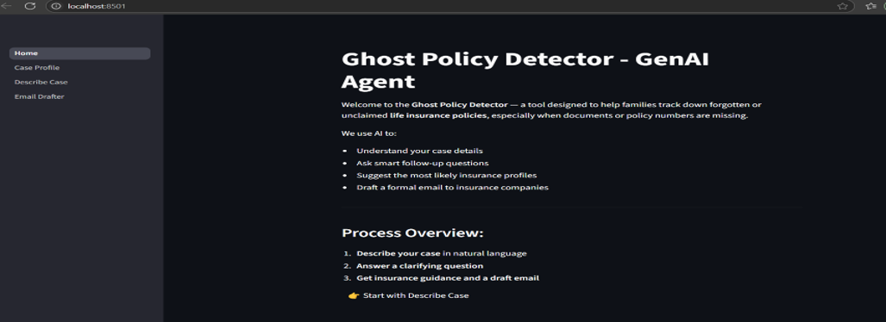
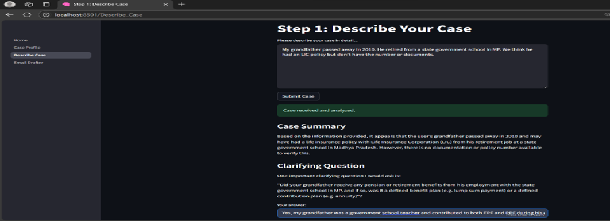
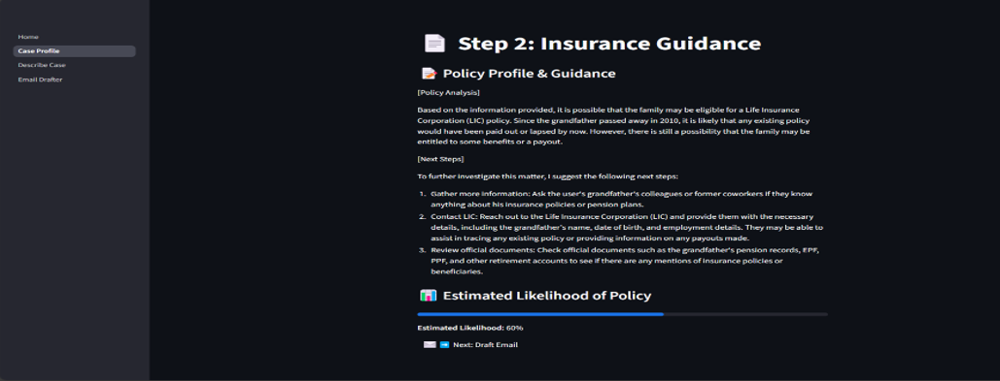
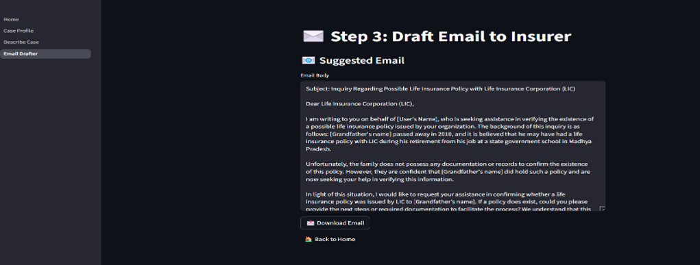

# ghost-policy-tracer

# 🧠 Ghost Policy Tracer – GenAI Assistant for Lost Insurance Recovery

Ghost Policy Tracer is a Generative AI-powered assistant that helps families recover lost or unclaimed life insurance policies of deceased loved ones. It simplifies the claim process using intelligent case analysis, clarifying Q&A, and auto-generated formal communication to insurers.

---

## 🚀 Features

- Accepts natural language case descriptions
- Asks one clarifying question to fill in missing info
- Infers possible LIC policy types
- Suggests next steps to recover a claim
- Drafts formal email for contacting insurers

---

## 🛠️ Tech Stack

- **Frontend:** Streamlit  
- **Backend:** Python  
- **AI Engine:** LLaMA 3 via Ollama (local GenAI)  
- **UI Logic:** Multi-step session state flow

---

## 📸 Screenshots

### 🧾 Step 1: Describe Case


### 🤖 Step 2: Policy Profile & Likelihood


### ✉️ Step 3: Email Drafter


### 📊 Visual Likelihood Score


---

## 🧩 How It Works

1. User describes a case (e.g., “My grandfather had an LIC policy...”)
2. AI summarizes it and asks one smart question
3. Based on the answer, the system infers policy type + guidance
4. Drafts a ready-to-send email to the insurer

---

## 📥 Setup Instructions

```bash
# Install dependencies
pip install -r requirements.txt

# Run Ollama and ensure llama3 model is loaded
ollama run llama3

# Start Streamlit app
streamlit run Home.py
